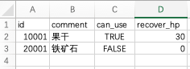
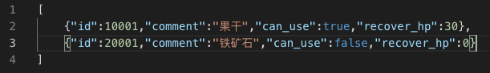
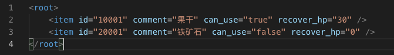
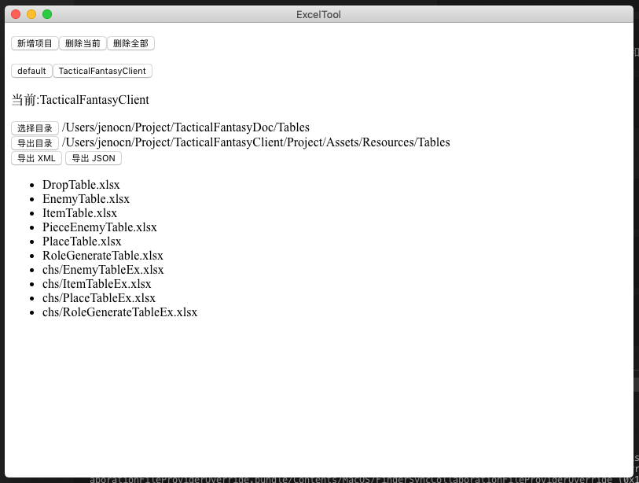

# ExcelTool

- 将指定结构的Excel表转换为xml/json文件
- 使用Electron框架开发,跨平台

Excel的优点是可以借助微软强大的编辑器处理和检查数据,而开发的时候,读取json/xml这类格式显然更适合一些,在游戏开发中,会使用到大量的配置文件,如果直接去配json/xml则不太效率,所以我开发了ExcelTool用于转换Excel到json/xml

## 表格结构和导出结构  
  
  
  

## 操作界面  

#### 项目
以项目为单位,保存目录状态,可以同时管理多个项目,每个项目可以设置一个Excel目录和一个导出目录,会自动检索Excel目录下的Excel文件,会自动生成一个default的默认项目

**新增项目** 新增一个项目
**删除当前** 删除当前选中项目
**删除全部** 删除default以外的所有目录

**选择目录** 点击后选择Excel文件的源目录,会检索当前目录的子目录,导出后也会根据目录结构导出
**导出目录** 点击后选择导出的目录
**导出XML** 导出xml文件,导出成功后会弹框提示,会列表提示导出成功的项和失败的项
**导出JSON** 导出json文件,同上

#### 列表区  
列表区展示检索到的所有excel文件
